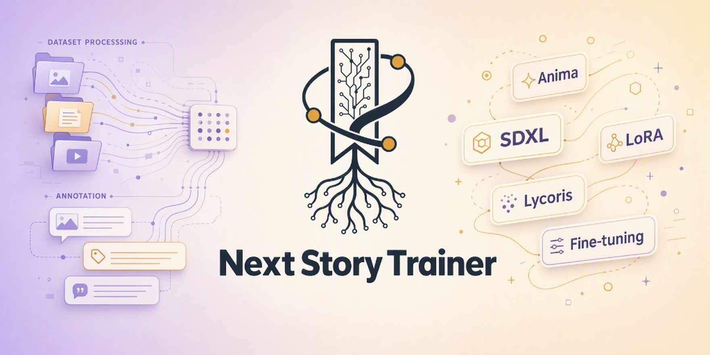

<p align="center">
  
</p>

<h1 align="center">Next Story Trainer</h1>

<p align="center">
  <b>One-click LoRA &amp; full finetune training GUI for Windows</b> — supports <b>Anima</b> / SD 1.5 / SDXL / Flux<br/>
  Extract and run. No environment setup needed. ~12 GB VRAM for Anima LoRA; <b>Anima full finetune needs ~24 GB</b>.<br/>
  <sub>Powered by <a href="https://github.com/kohya-ss/sd-scripts">kohya-ss/sd-scripts</a>, Akegarasu-style GUI. Maintained at <a href="https://github.com/storyAura/lora-scripts-story-next">storyAura/lora-scripts-story-next</a>.</sub>
</p>

<p align="center">
  <a href="https://github.com/storyAura/lora-scripts-story-next"></a>
  <a href="LICENSE"></a>
</p>
<p align="center">
  <a href="README.md"><b>中文（默认）</b></a>
  ·
  <a href="NOTICE.md"><b>Credits</b></a>
</p>

---

## How this fork differs

**Next Story Trainer** (`lora-scripts-story-next`) evolves independently from the upstream Next Trainer line. It focuses on day-to-day Anima training and multi-job queues, rather than mirroring every experimental upstream branch.

| Area | This repo | Typical upstream focus |
|------|-----------|------------------------|
| **Training queue** | Sidebar queue: enqueue many jobs, auto conveyor, history retry / edit | Mostly one-shot submit |
| **Long-run stability** | SSE logs past 15k lines, bounded task/log history, kill full process tree before next run | Basic task lifecycle |
| **Anima surface** | LoRA / LoKr / T-LoRA, **LyCORIS 4.0** (fused kernels, default `auto`) + local overlay, Fast plugin path, full finetune; **Anima 2.9B** LoRA / Finetune as separate pages; **same-epoch multi-resolution training** (free-fit tiers) | Varies by upstream release |
| **UI & identity** | Next Story Trainer branding, EN/ZH UI dictionaries, this repo’s Releases & contact | Upstream branding & release channel |
| **Not shipped here** | No **Anima Edit** experimental branch entry | May host separate experiment branches |

Use this repository’s Releases and docs for daily work. Upstream attribution lives in Credits below and [NOTICE.md](NOTICE.md).

---

## Get Started in 3 Steps

```
1. Download  →  Portable pack (e.g. SD-Trainer-v2.8.2.7z) from [Releases](https://github.com/storyAura/lora-scripts-story-next/releases), extract
2. Launch    →  Double-click run_gui.bat (auto-installs deps on first run, ~3 GB)
3. Train     →  Open http://127.0.0.1:28000, pick a model, set params, start training
```

> **Requirements:** Windows 10/11, NVIDIA GPU (RTX 20+), ~7 GB disk.

For tagger paths, CLI/cloud training, and upgrade notes see **[Portable getting started (details)](docs/portable-getting-started.md)**.

<details>
<summary><b>Install from source (Linux / advanced users)</b></summary>

```sh
git clone https://github.com/storyAura/lora-scripts-story-next.git
cd lora-scripts-story-next

# Windows
run_gui.bat

# Linux
bash install.bash && bash run_gui.sh

# Optional: install Flash Attention 2 for faster Anima training
# Windows
install_flash_attn.bat
# Linux
bash install_flash_attn.sh
```

CLI entrypoints: `train_anima_by_toml.sh` (standard Anima), `train_anima_fast_by_toml.sh` (Fast plugin). Python **3.10** recommended. See [Flash Attention 2 docs](docs/flash-attention.md).

</details>

---

## What's Supported

| Mode | Model / script | Notes |
|------|----------------|-------|
| **Anima LoRA** | LoRA · LoKr · **T-LoRA** · **LyCORIS 4.0** | Flash Attention 2 / xformers / SDPA · from ~12 GB VRAM · LyCORIS kernel default `auto` · optional **same-epoch multi-resolution** |
| **Anima LoRA Fast** | LoRA only (plugin) | Optional [anima_lora](https://github.com/sorryhyun/anima_lora) runtime · ~16 GB+ · see [`docs/anima-fast.md`](docs/anima-fast.md) |
| **Anima Finetune** | Full DiT (`anima_train.py`) | Sidebar **Full Finetune → Anima Finetune** · **~24 GB VRAM** (4090-class) · also supports multi-resolution |
| SD 1.5 / SDXL LoRA | LoRA · LoHa · LoKr | xformers / SDPA |
| SD 1.5 / SDXL Finetune | Dreambooth / SDXL finetune | Sidebar **Full Finetune → Stable Diffusion** |
| Flux | LoRA | xformers / SDPA |

<p align="center">
  
</p>

<p align="center"><sub>Anima LoRA (Expert mode) — sidebar, model &amp; dataset form, config preview on the right</sub></p>

<p align="center">
  
</p>

<p align="center"><sub>Anima LoRA Fast — optional <code>sorryhyun/anima_lora</code> plugin path; install via in-page button or <code>scripts/cli/install_anima_fast.*</code>. See <a href="docs/anima-fast.md">docs/anima-fast.md</a></sub></p>

<p align="center">
  
</p>

<p align="center"><sub>Training Queue — submit multiple jobs, auto-run conveyor, history with retry / edit / delete</sub></p>

<p align="center">
  
</p>

<p align="center"><sub>Help → Training Parameters — beginner quick-reference for the knobs that actually matter</sub></p>

---

## Train Monitor

Automatically opens a monitor page (port 6008) when training starts — GPU stats, training parameters, Loss curves, preview samples, and logs all in one dashboard.

**Hardened for long runs (v2.9.1+):** live log streaming keeps flowing past 15,000 lines, task/log history is memory-bounded so multi-day sessions don't accumulate RAM, and TensorBoard curve parsing is cached between polls.

**v2.9.2:** stopping a run now waits until the full process tree is dead before the next job can start (fixes dual-training Loss/Epoch jumps); monitor Loss, LR, and params stay bound to the active task and TensorBoard.

**v2.9.3:** GSoKR BF16 merge path fixed; Next Story Trainer brand assets landed; English UI dictionaries (Chrome / Schema / Help) with whole-block Markdown description translation; contact + GitHub point to this repo; LoRA training intro synced.

**v2.9.4:** **Same-epoch multi-resolution training** (`multires_per_image`) — Anima LoRA / Finetune can train each image once per free-fit tier (e.g. `512,1024`) within one epoch; sample count scales with the number of tiers, so lower the epoch count. See [`docs/proposal/multires_per_image_migration.md`](docs/proposal/multires_per_image_migration.md).

**v2.9.5:** Fixed SDXL LoRA crash on missing `blocks_to_swap`; local 10-step smoke passed; brand assets refreshed (logo/cover/banner) and upstream Next Trainer images purged.

**v2.9.6:** **Pre-launch disk space check** — estimates checkpoints / disk caches / log margin and fails structured (`disk_space`) before write when free space is short (avoids `Errno 28`); bypass with `MIKAZUKI_SKIP_DISK_PREFLIGHT=1`.

**v2.9.7:** sidebar **Quick Infer** (Anima) with auto base-model fill and GPU-busy guard; save option `no_metadata`; preview heun / normal / `sample_flow_shift`; T-LoRA export drops `*_state` buffers. Smoke: `venv\Scripts\python.exe -m pytest -q tests\test_infer_smoke.py`.

**v2.9.8:** **Anima 2.9B** split into two pages — **Anima2.9B** under Anima LoRA, and **Anima2.9B Finetune** under full finetune; optional train-inserted-layers-only. Local 2-step LoRA GPU smoke passed.

**Unreleased (main):** **LyCORIS 4.0** — vendored baseline 4.0.0 (fused kernels, default `auto`) with local overlay algos (bokr / bora / gsokr / glora_boft); Anima LyCORIS defaults `train_llm_adapter`; kohya path honors `exclude_name` (`*adaln_modulation*`). Disk preflight estimates per volume with a single margin; sidebar **UI Settings** renamed **Trainer Settings**.

<p align="center">
  
</p>

<p align="center"><sub>Train Monitor — status, params, and preview samples in one dashboard</sub></p>

---

<details>
<summary><b>VRAM Reference (Anima, 1024 resolution, RTX 4090 benchmarked)</b></summary>

**Anima LoRA**

| VRAM | Configuration | Notes |
|------|---------------|-------|
| ≥ 24 GB | Default settings | Easiest |
| ≥ 16 GB | `gradient_checkpointing` | Recommended |
| ≥ 12 GB | Gradient checkpointing | Stable |
| ≥ 10 GB | Gradient checkpointing + `blocks_to_swap=16` | Slightly slower |
| ≥ 8 GB | Gradient checkpointing + swap 24 + cache TE + LoKr | Tight |

**Anima full finetune** (updates full DiT weights — use **Anima Finetune** in the WebUI, not LoRA)

| VRAM | Configuration | Notes |
|------|---------------|-------|
| ≥ 24 GB | Default + latents/TE cache | **~23–24 GB dedicated VRAM** in practice; 4090-class recommended |

</details>

<details>
<summary><b>Documentation</b></summary>

| Topic | Link |
|-------|------|
| **Portable pack details (tagger / CLI / upgrade)** | [docs/portable-getting-started.md](docs/portable-getting-started.md) |
| Anima LoRA Training Guide | [docs/anima-training.md](docs/anima-training.md) |
| **Anima Fast Mode (optional plugin)** | [docs/anima-fast.md](docs/anima-fast.md) |
| Open-source notices | [NOTICE.md](NOTICE.md) |
| Anima backend (LoRA + full finetune) | [docs/anima-backend.md](docs/anima-backend.md) |
| Anima full finetune example TOML | [docs/examples/anima-full-finetune.toml](docs/examples/anima-full-finetune.toml) |
| Flash Attention 2 | [docs/flash-attention.md](docs/flash-attention.md) |
| Train Monitor & SSE API | [docs/train-monitor.md](docs/train-monitor.md) |
| Tagger model directory (`tagger-models/`) | [docs/tagger-models.md](docs/tagger-models.md) |
| Docker Deployment | [docs/docker.md](docs/docker.md) |
| CLI Arguments | [docs/cli-args.md](docs/cli-args.md) |

</details>

<details>
<summary><b>Changelog</b></summary>

| Date | Version |
|------|---------|
| 2026-09-02 | **Unreleased** — **LyCORIS 4.0**: baseline 4.0.0 + overlay; kernel default `auto`; default `train_llm_adapter`; kohya honors `exclude_name`; disk preflight estimate fix; sidebar **Trainer Settings** · see [CHANGELOG.md](CHANGELOG.md) |
| 2026-08-15 | **v2.9.8** — **Anima 2.9B**: separate LoRA / Finetune pages; optional inserted-layer-only training; 2-step LoRA GPU smoke · see [CHANGELOG.md](CHANGELOG.md) |
| 2026-08-11 | **v2.9.7** — **Quick Infer** (Anima) + auto base fill + `no_metadata`; preview heun/normal/flow_shift; T-LoRA drops `*_state`; smoke `tests/test_infer_smoke.py` · see [CHANGELOG.md](CHANGELOG.md) |
| 2026-08-10 | **v2.9.6** — **pre-launch disk space check**: structured reject when short (avoids `Errno 28`); bypass `MIKAZUKI_SKIP_DISK_PREFLIGHT=1` · see [CHANGELOG.md](CHANGELOG.md) |
| 2026-08-08 | **v2.9.5** — **SDXL LoRA** crash fix + smoke; **brand** refresh (new logo/cover/banner), purge upstream Next Trainer images · see [CHANGELOG.md](CHANGELOG.md) |
| 2026-08-06 | **v2.9.4** — **same-epoch multi-resolution** (`multires_per_image`); multi-line preview prompts · see [CHANGELOG.md](CHANGELOG.md), [`docs/proposal/multires_per_image_migration.md`](docs/proposal/multires_per_image_migration.md) |
| 2026-08-05 | **v2.9.3** — GSoKR BF16 merge fix; Next Story Trainer brand assets; English i18n; contact / GitHub → this repo · see [CHANGELOG.md](CHANGELOG.md) |
| 2026-08-04 | **v2.9.2** — dual-training after stop fixed; monitor Loss / LR / params bound to active task · see [CHANGELOG.md](CHANGELOG.md) |
| 2026-07-27 | **v2.9.1** — long-run stability; T-GLoKR; Beta preview scheduler · see [CHANGELOG.md](CHANGELOG.md) |
| 2026-07-22 | **v2.9.0** — Anima Fast bucket controls, LoKr preview fixes, offline tagger |
| 2026-06-27 | **v2.8.2** — portable SDXL / tagger / preview / config-import fixes |
| 2026-05-28 | **v2.7.0** — Anima LoRA Fast mode · see [`docs/anima-fast.md`](docs/anima-fast.md) |
| 2026-05-28 | **v2.6.0** — Anima full finetune WebUI |
| 2026-05-27 | **v2.5.3** — portable dependency health check, sidebar version chip |
| 2026-05-18 | **v2.0.0** — first portable release |

Full details in [CHANGELOG.md](CHANGELOG.md).

</details>

<details>
<summary><b>Credits</b></summary>

Forked from [wochenlong/lora-scripts-next](https://github.com/wochenlong/lora-scripts-next), with Akegarasu-style GUI and kohya training stack:

[wochenlong/lora-scripts-next](https://github.com/wochenlong/lora-scripts-next) · [Akegarasu/lora-scripts](https://github.com/Akegarasu/lora-scripts) · [kohya-ss/sd-scripts](https://github.com/kohya-ss/sd-scripts) · [LyCORIS](https://github.com/KohakuBlueleaf/LyCORIS) · [T-LoRA](https://github.com/ControlGenAI/T-LoRA) — full attribution in [NOTICE.md](NOTICE.md)

</details>

---

<p align="center"><sub>Maintainer: <b><a href="https://github.com/storyAura">@storyAura</a></b> · <a href="CONTRIBUTORS.md">Contributors</a></sub></p>
